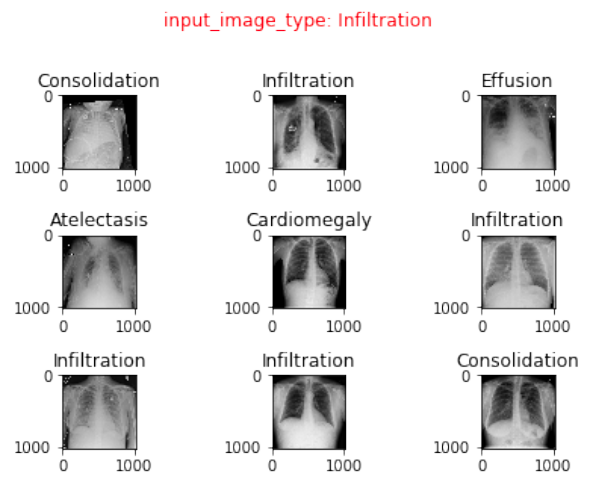

## I. INTRODUCTION

We have taken the dataset from Kaggle. The dataset is
provided by NIH and contains images of different lung
diseases. There are 14 different classes of diseases. Each photo
is marked with its name and disease class in a csv file.
To classify the disease into one of the 14 different disease
classes, we used a neural network to train the data provided.
The project contains 3 main steps.
1. Extract orb and LBP features
2. Create neural network models by using the extracted
features
3. Retrieve relevant images based on the models created
in the previous step

## II. RELATED WORK:
1. In a paper released by national library of medicine
[1], lung region segmentation along with shape based
features, hog, LBP, Tamura features, Gabor texture
features were used.
2. In another paper released by national library of
medicine [2], convolution neural networks were used
to attain an accuracy of 99%. Though it was on the
same data set, it was done for different purpose, i.e.
to differentiate between frontal and lateral view of
chest images

## III. USED METHOD:
### Feature Extraction:
### 1. ORB (Oriented rotation and brief) features:
Orb is abbreviated form of oriented rotation and brief features,
it is similar to sift and surf features.
ORB uses FAST (features from accelerated segment test) to
detect key points and brief to find the descriptors.
 On each image orb features were calculated and output in the
form of a vector was obtained. Vectors obtained from all the
images contained features described in small number to large
number of elements. The number of elements in the vector
can’t be predetermined and depends on the image. Features
obtained for each image were added to a matrix. This matrix
contains features of all the images. 

### 2. LBP (Local binary pattern) features:
Local binary pattern features are very effective in finding the
local feature in the images.
Local binary pattern features are calculated using the
following method.
a. For each pixel we consider the eight neighbors of it.
b. When center pixel is greater than the neighbor pixel
we add one to the vector.
c. When center pixel is lesser than the neighbor pixel
we add zero to the vector.
d. After iterating through all the neighbors we have a
vector of size 8.
e. Steps b, c, d are executed for all the pixels in the
image
f. As the vector is a binary vector of size 8, the local
binary pattern value ranges from 0 to 256.
g. To reduce the no of descriptors without losing the
rotation invariance, we follow a method called
uniform local binary pattern
h. If there are 2 or less than 2 transitions in a binary
pattern, we call it uniform, else it is non-uniform
binary pattern.
i. There are 58 binary patterns and all the non-uniform
binary patterns are combined into a single bin and we 
effectively have a 59 element binary pattern instead
of 265 element binary pattern.
j. The LBP descriptor is a histogram representing
frequency of each binary pattern.

The image was divided into different no of parts. The image
was divided into 2*2, 3*3 and 4*4 parts respectively.
LBP was calculated for each of these images and concatenated
into a single vector. The no of features is 59*(16+9+4+1) =
1770 descriptors.

### 3. Dimensionality reduction using principal component analysis (PCA):
Principal component analysis converts the descriptors into
linearly independent variables by using orthogonal
transformation. Principal component analysis was applied on
orb features and LBP features respectively. A fixed size of 500
components was set as output size for PCA. 

### 4. Dimensionality reduction using locally linear
embedding(LLE):
LLE solves globally non-linear problems using locally linear
fitting. LLE was applied on orb and LBP features respectively.
A fixed size of 500 components was set as output size for
LLE.
### 5. Concatenating ORB and LBP features:
The outputs obtained by applying dimensionality reduction to
LBP and orb features are of size 500 and 500 respectively.
Both these features are concatenated to obtain a vector with a
size of 1000 elements.
These features will be used to train the neural network and
find the classification of disease.

### 6. Neural network model:
To classify the output into one of the 14 classes, an artificial
neural network is trained on the dimension reduced feature set.
The neural network used is an artificial neural network with 1
input layer, 5 hidden layers and 1 output layer. The input layer
contains 1000 neurons as it is the size of feature set. Each
subsequent hidden layers contain neurons half the size of
previous layer. So the sizes of hidden layers are 500, 250, 125,
63, 32 and 16 respectively. The size of output layer is 14 as it
is the number of classes we are classifying the output into. The
optimizer used was Adam. Categorical cross entropy loss
function and categorical accuracy metric was used to optimize
the neural network. The model was fit on the training data
obtained from previous steps. This model will be used to
predict the disease given the image.

## IV. IMAGE RETRIEVAL:
Initially we use the model to predict the probabilities of image
belonging to each class. The probabilities range between 0 and
1 for each class. These probabilities were calculated for each
image and all the values are stored on the disk.
To retrieve images related to the query image, we first
calculate the orb and LBP features for new image.
Dimensionality reduction was applied on these features, and
concatenated. This vector is passed as input to the trained
model and output probabilities are obtained.

The highest probability is obtained and is subtracted with
probability of all images. The images with least difference are
the matching images to the query image.

## V. EXPERIMENTAL RESULTS:
Precision = tp/(tp+fp)
Recall = tp/(tp+fn)
Where tp = true positives
And fn = false negatives
And fp = false positives

Using PCA
Precision for image 1 = 4/9
Recall for image 1 = 4/1582

Using LLE
Precision for image 1 = 5/9
Recall for image 1 = 5/1582

## VI. CONCLUSION:
Using LLE as dimensionality reduction technique, a better
precision and recall was obtained compared to PCA technique.

## VII. REFERENCES:
[1] https://pdfs.semanticscholar.org/19f9/863d16b2a3376b27af07fc803e7713c790e0.pdf
[2] https://lhncbc.nlm.nih.gov/system/files/pub9175.pdf
[3] http://journals.plos.org/plosone/article/file?id=10.1371/journal.pone.0082409&type=printable
